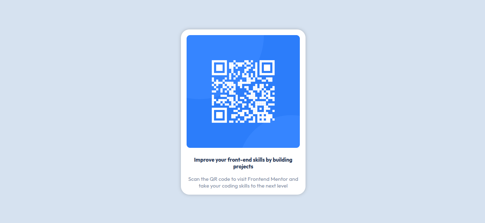

# Frontend Mentor - QR code component solution

This is a solution to the [QR code component challenge on Frontend Mentor](https://www.frontendmentor.io/challenges/qr-code-component-iux_sIO_H). Frontend Mentor challenges help you improve your coding skills by building realistic projects. 

## Table of contents

- [Overview](#overview)
  - [Screenshot](#screenshot)
  - [Links](#links)
- [My process](#my-process)
  - [Built with](#built-with)
  - [What I learned](#what-i-learned)
  - [Continued development](#continued-development)
  - [Useful resources](#useful-resources)
- [Author](#author)
- [Acknowledgments](#acknowledgments)


## Overview

### Screenshot




### Links

- Solution URL: [Add solution URL here](https://your-solution-url.com)
- Live Site URL: [Add live site URL here](https://your-live-site-url.com)

## My process

### Built with

- HTML5
- CSS custom properties
- Flexbox
- Desktop-first workflow

**Note: These are just examples. Delete this note and replace the list above with your own choices**

### What I learned

In this challenge, I learned the art of centralizing cards using flexbox by justifying the content in the parent element and aligning items in the child element.


```css
main {
  display: flex;
  justify-content: center;
}

child-element {
  display: flex;
  align-items: center;
}
```

### Continued development

I would be working on using CSS variables in future projects and challenges.

### Useful resources

- [Dave Grey Tutorials](https://courses.davegray.codes/) - This helped me for building basics in CSS, Dave is an amazng tutor. I really liked his breakdown of CSS in his basic course.

## Author

- Website - [King David Ajayi](https://mainstack.me/watcherking24)
- Frontend Mentor - [@daking24](https://www.frontendmentor.io/profile/daking24)
- Twitter - [@daking3968](https://www.twitter.com/daking3968)


## Acknowledgments

Gratitude goes to Dave Grey for his tutorials and course outlines.
